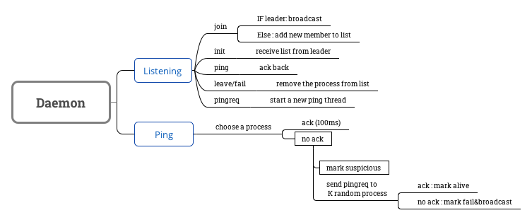

# CS425 MP2
## Gohar Irfan Chaudhry (gic2) and Yang Liu (liu310)
### Instructions/Notes
#### Build the project from a clean state:
```
mvn clean install
```
#### Start Daemon:
##### As a leader:
```
mvn exec:java -Dexec.mainClass="edu.illinois.cs.cs425.Daemon" -Dexec.args="-l -p <portNumber>"
```
```
E.g. mvn exec:java -Dexec.mainClass="edu.illinois.cs.cs425.Daemon" -Dexec.args="-l -p 6667"
```

If you want to make the leader recover from a previous member list, use:
```
mvn exec:java -Dexec.mainClass="edu.illinois.cs.cs425.Daemon" -Dexec.args="-l -p <portNumber> -r"
```
```
E.g. mvn exec:java -Dexec.mainClass="edu.illinois.cs.cs425.Daemon" -Dexec.args="-l -p 6667 -r"
```
##### As a common member:
```
mvn exec:java -Dexec.mainClass="edu.illinois.cs.cs425.Daemon" -Dexec.args="-a <leaderHostName> -p <portNumber>"
```
```
E.g. mvn exec:java -Dexec.mainClass="edu.illinois.cs.cs425.Daemon" -Dexec.args="-a fa16-cs425-g10-01.cs.illinois.edu:6667 -p 6680"
```
_(Note: Default portNumber is 6667 if not specified. 
Reminder: portNumber-1 & portNumber-2 are automatically ocuppied.)_

_(Attention! cannot implement more than one leaders in a group!)_
### Architecture of the project



